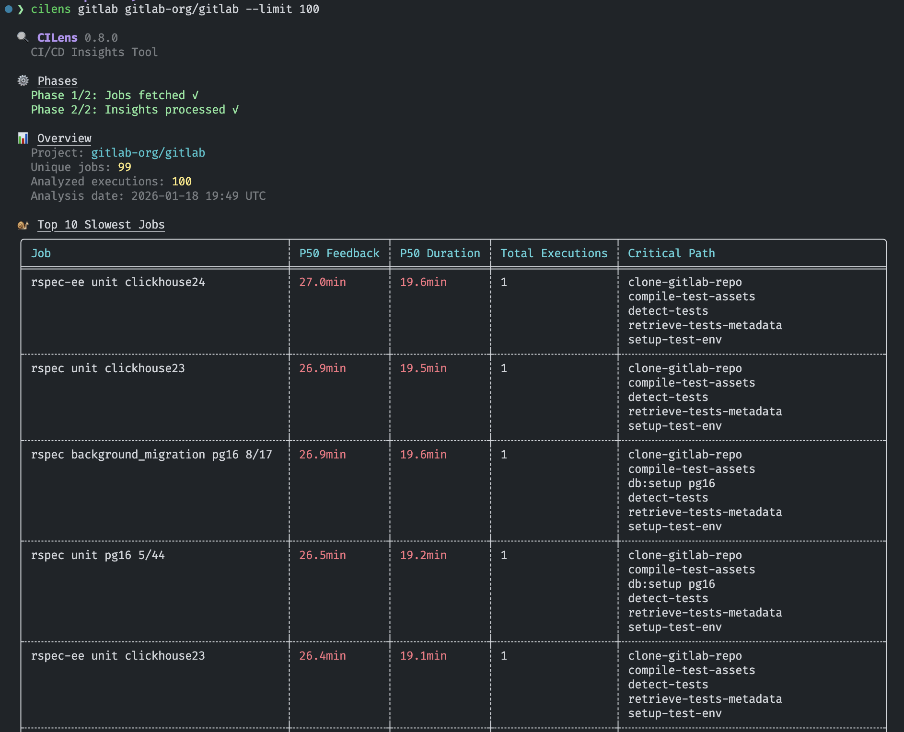

# 🔍 CILens - CI/CD Insights Tool

A Rust CLI tool for collecting and analyzing CI/CD insights from GitHub Actions and GitLab.



## ✨ Features

- **📊 Duration Percentiles (P50, P95, P99)** - Realistic performance expectations showing typical, planning, and worst-case scenarios instead of misleading averages
- **⏱️ Per-Job Time-to-Feedback** - Shows how long each job takes from pipeline start to completion, revealing actual wait times for developers
- **🔍 Dependency Tracking** - Identifies which jobs block others via the `needs` keyword, showing the critical path
- **🔄 Retry Detection** - Identifies jobs that fail intermittently and need retries, highlighting reliability issues
- **✅ Failure Rate Metrics** - Per-job failure rates to identify which jobs catch real bugs vs false positives
- **🎯 Optimization Insights** - Jobs sorted by P50 (median) time-to-feedback to quickly identify highest-impact optimization targets
- **💾 Smart Caching** - Job data cached indefinitely (immutable after success/failure) for instant subsequent runs
- **🎚️ Noise Filtering** - Automatically filters out rarely-executed jobs (configurable threshold)

## 📦 Installation

### Installer Script

Install the latest version for your platform:

```bash
curl --proto '=https' --tlsv1.2 -LsSf https://github.com/dsalaza4/cilens/releases/download/v0.8.0/cilens-installer.sh | sh
```

### Nix

Install using Nix flakes:

```bash
nix profile install github:dsalaza4/cilens/v0.8.0
```

Or run without installing:

```bash
nix run github:dsalaza4/cilens/v0.8.0 -- --help
```

## 🚀 Quick Start

### GitHub Actions

```bash
# Get your GitHub token from: https://github.com/settings/tokens
# Required scope: actions:read
# Keep in mind that if you do not use a token,
# Unauthenticated rate limiting will apply.

export GITHUB_TOKEN="ghp-your-token"

cilens github owner/repo
```

### GitLab

```bash
# Get your GitLab token from: https://gitlab.com/-/profile/personal_access_tokens
# Required scope: read_api

export GITLAB_TOKEN="glpat-your-token"

cilens gitlab group/project
```

## 💡 Usage

```bash
# Default: Human-readable summary
cilens github owner/repo

# JSON output for programmatic analysis
cilens github owner/repo --json                # Compact
cilens github owner/repo --json-pretty         # Pretty-printed

# Self-hosted instances
cilens github owner/repo --base-url "https://github.example.com"

# Adjust noise filtering (default: 0.2% of total executions)
cilens github owner/repo --min-executions-percentage 0.5 # More aggressive
cilens github owner/repo --min-executions-percentage 0   # No filtering

# Fetch more jobs (default: 2000)
cilens github owner/repo --limit 5000

# Clear cached data
cilens github owner/repo --clear-cache
```

> [!TIP]
>
> All flags work identically for both `github` and `gitlab` commands.

### 🔄 Reliability & Performance

CILens is designed to handle large-scale job fetches reliably:

- **Automatic Retry**: Network errors, rate limits (429), and server errors (5xx) are automatically retried up to 30 times with 10-second delays
- **Concurrency Limiting**: 300 concurrent requests for GitHub Actions, 500 for GitLab
- **Pagination**: Automatically handles pagination (100 per page for GitHub, 50 per page for GitLab)
- **Graceful Degradation**: Transient failures are logged and retried transparently

This makes it suitable for analyzing projects with thousands of job executions even from busy CI/CD instances.

### ⚡ Caching

CILens automatically caches job data for instant subsequent runs:

- **90%+ Speedup**: Cached runs are typically 10x faster since job data is loaded from disk
- **Immutable Jobs**: Successful and failed jobs are immutable and cached indefinitely
- **Smart Merging**: Cache automatically merges with fresh API data if more jobs are needed
- **Per-Project Cache**: Each project gets its own cache file
- **Platform-Aware**: Uses platform-specific cache locations:
  - Linux: `~/.cache/cilens/{github,gitlab}/`
  - macOS: `~/Library/Caches/cilens/{github,gitlab}/`
  - Windows: `%LOCALAPPDATA%\cilens\{github,gitlab}\`
- **Transparent**: Automatically checks cache before fetching from API

#### Cache Management

```bash
# Use cache automatically (default)
cilens github owner/repo

# Clear cache to force fresh data
cilens github owner/repo --clear-cache
```

**When to clear cache**: When you want to ensure you have the absolute latest job data, or when testing changes to job configurations.

## 📄 Output Formats

CILens provides two output formats to suit different use cases:

### 📊 Summary Output (Default)

By default, CILens displays a human-readable summary with actionable insights.
The summary includes:

**Overview Section:**

- Project name
- Unique jobs analyzed
- Total job executions
- Analysis timestamp

**Analysis Tables:**

- **Top 10 Slowest Jobs**: Jobs with highest P50 time-to-feedback (best optimization targets), showing P50 feedback time, P50 duration, total executions, and critical path dependencies
- **Top 10 Failing Jobs**: Most unreliable jobs sorted by failure rate, showing failure percentage, total executions, and critical path dependencies
- **Top 10 Retried Jobs**: Most intermittent jobs sorted by retry rate, showing retry percentage, total executions, and critical path dependencies

All tables use color coding for quick visual analysis:

- 🟢 **Green**: Good values (failures <25%, retries <5%, durations ≤10min)
- 🟡 **Yellow**: Warning values (failures 25-50%, retries 5-10%, durations 10-15min)
- 🔴 **Red**: Critical values (failures ≥50%, retries ≥10%, durations >15min)

### 📋 JSON Output

For programmatic analysis or integration with other tools, use the `--json` flag:

```json
{
  "provider": "GitLab",
  "project": "group/project",
  "collected_at": "2025-12-21T17:31:48Z",
  "total_jobs": 3,
  "jobs": [
    {
      "name": "integration-tests",
      "duration_p50": 400.0,
      "duration_p95": 480.0,
      "duration_p99": 520.0,
      "time_to_feedback_p50": 610.0,
      "time_to_feedback_p95": 720.0,
      "time_to_feedback_p99": 780.0,
      "predecessors": [
        "lint",
        "build"
      ],
      "retry_rate": 0.0,
      "retried_executions": {
        "count": 0,
        "links": []
      },
      "failure_rate": 0.0,
      "failed_executions": {
        "count": 0,
        "links": []
      },
      "success_rate": 100.0,
      "successful_executions": {
        "count": 5,
        "links": ["https://gitlab.com/group/project/-/jobs/101", "https://gitlab.com/group/project/-/jobs/102"]
      },
      "total_executions": 5
    },
    {
      "name": "build",
      "duration_p50": 175.0,
      "duration_p95": 200.0,
      "duration_p99": 210.0,
      "time_to_feedback_p50": 220.0,
      "time_to_feedback_p95": 250.0,
      "time_to_feedback_p99": 265.0,
      "predecessors": [
        "lint"
      ],
      "retry_rate": 0.0,
      "retried_executions": {
        "count": 0,
        "links": []
      },
      "failure_rate": 0.0,
      "failed_executions": {
        "count": 0,
        "links": []
      },
      "success_rate": 100.0,
      "successful_executions": {
        "count": 5,
        "links": ["https://gitlab.com/group/project/-/jobs/201", "https://gitlab.com/group/project/-/jobs/202"]
      },
      "total_executions": 5
    },
    {
      "name": "lint",
      "duration_p50": 42.0,
      "duration_p95": 58.0,
      "duration_p99": 62.0,
      "time_to_feedback_p50": 42.0,
      "time_to_feedback_p95": 58.0,
      "time_to_feedback_p99": 62.0,
      "predecessors": [],
      "retry_rate": 44.44,
      "retried_executions": {
        "count": 4,
        "links": ["https://gitlab.com/group/project/-/jobs/501", "https://gitlab.com/group/project/-/jobs/502", "https://gitlab.com/group/project/-/jobs/503", "https://gitlab.com/group/project/-/jobs/504"]
      },
      "failure_rate": 0.0,
      "failed_executions": {
        "count": 0,
        "links": []
      },
      "success_rate": 100.0,
      "successful_executions": {
        "count": 9,
        "links": ["https://gitlab.com/group/project/-/jobs/301", "https://gitlab.com/group/project/-/jobs/302"]
      },
      "total_executions": 9
    }
  ]
}
```

### 📖 JSON Schema Explained

When using `--json` output, the data structure includes:

**Top-Level Fields:**
- **`provider`**: CI provider name (e.g., "GitHub", "GitLab")
- **`project`**: Project identifier (e.g., "owner/repo" for GitHub, "group/project" for GitLab)
- **`collected_at`**: Timestamp when insights were collected
- **`total_jobs`**: Total number of unique jobs analyzed (after filtering)

**Job Metrics** (sorted by `time_to_feedback_p50` descending):
- **`name`**: Job name
- **`duration_p50`**: Median job execution time in seconds (typical duration)
- **`duration_p95`**: 95th percentile job duration (for planning SLAs)
- **`duration_p99`**: 99th percentile job duration (outlier detection)
- **`time_to_feedback_p50`**: Median time from pipeline start to job completion in seconds (calculated from successful first-try jobs only)
- **`time_to_feedback_p95`**: 95th percentile time to feedback (planning metric) (calculated from successful first-try jobs only)
- **`time_to_feedback_p99`**: 99th percentile time to feedback (worst-case) (calculated from successful first-try jobs only)
- **`predecessors`**: Job names that must complete before this one (on the critical path to this job). Note: GitLab extracts from `needs` keyword; GitHub shows "N/A" (GitHub API does not support job needs)
- **`retry_rate`**: Percentage of job executions that were retries (0.0 if job never needed retries). GitLab uses `retried` flag; GitHub uses `run_attempt > 1`
- **`retried_executions`**: Object with `count` and `links` - clickable URLs to investigate specific retried job runs
- **`failure_rate`**: Percentage of executions that failed and stayed failed (indicates how often the job catches real bugs)
- **`failed_executions`**: Object with `count` and `links` - clickable URLs to investigate failed job runs
- **`success_rate`**: Percentage of executions that succeeded
- **`successful_executions`**: Object with `count` and `links` - clickable URLs to investigate successful job runs
- **`total_executions`**: Total number of times this job executed across all pipelines, including successful runs, retries, and failures

**Understanding Percentiles:** Percentiles show the distribution of values rather than just the average, which can be misleading for skewed data. P50 (median) represents typical performance, P95 is better for capacity planning and SLAs (95% of runs complete within this time), and P99 helps identify outliers.

**Finding optimization targets:** Jobs with the highest `time_to_feedback_p50` have the slowest typical feedback time and are the best candidates for optimization. Check their `predecessors` to see if you can parallelize or speed up dependencies. Jobs with high `retry_rate` indicate intermittent reliability issues - click the `retried_executions.links` to investigate specific retried runs. Jobs with high `failure_rate` are successfully catching bugs - click the `failed_executions.links` to see which runs failed and analyze the logs.
